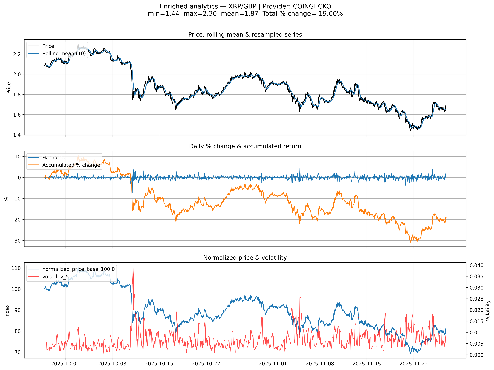

# Crypto Analytics Backend— FastAPI, Clean Architecture & Data Visualization


A structured backend application that retrieves live crypto data, enriches it with pandas analytics, and exposes JSON and PNG plots through a fully modular FastAPI design.

--> Live API: https://crypto-analytics-engine.onrender.com



## 📚 Table of Contents

- [1. Motivation & Goals](#1-motivation--goals)
- [2. Key Features](#2-key-features)
- [3. Tech Stack](#3-tech-stack)
- [4. Project Architecture](#4-project-architecture)
  - [4.1 Folder Structure](#41-folder-structure)
  - [4.2 Request / Data Flow](#42-request--data-flow)
- [5. Domain Enums & Data Model](#5-domain-enums--data-model)
  - [5.1 Core Enums](#51-core-enums)
  - [5.2 Core Data Models](#52-core-data-models)
- [6. API Endpoints](#6-api-endpoints)
  - [6.1 GET /api/v1/market_chart/](#61-get--apiv1market_chart)
  - [6.2 GET /api/v1/market_chart/stats](#62-get--apiv1market_chartstats)
  - [6.3 GET /api/v1/market_chart/dataframe](#63-get--apiv1market_chartdataframe)
  - [6.4 GET /api/v1/market_chart/{symbol}/{currency}/plot-enriched](#64-get--apiv1market_chartsymbolcurrencyplot-enriched)
- [7. Running Locally](#7-running-locally)
- [8. Testing](#8-testing)
- [9. Deployment](#9-deployment)
- [10. Future Improvements](#10-future-improvements)
- [11. About / Context](#11-about--context)
- [12. License](#12-license)


## 🚀 Quickstart (TL;DR)

```bash
# 1. Create virtual environment
python -m venv .venv && source .venv/bin/activate

# 2. Install dependencies
pip install -r requirements.txt

# 3. Start API
uvicorn app.api.main:app --reload

# 4. Fetch example market chart
curl "http://localhost:8000/api/v1/market_chart/?symbol=bitcoin&currency=usd&days=30&provider=coingecko"

# 5. Generate enriched PNG plot
curl -o btc.png "http://127.0.0.1:8000/api/v1/market_chart/bitcoin/usd/plot-enriched?days=60&provider=coingecko&window_size=10&normalize_base=25&volatility_window=5"
```

## 1. Motivation & Goals

Building modern AI systems requires solid backend fundamentals.  
Before copilots, dashboards or agents can exist, you need clean, reliable, analytics-ready data pipelines.

This project was created as the first milestone of my **AI Engineer Roadmap**, with one objective:  
**transform raw, unreliable crypto market data into validated domain models, enriched analytics, and production-ready API outputs.**

### Why this project matters
- External crypto APIs are noisy, inconsistent, and often incomplete.  
- Real applications depend on predictable, structured and validated historical data.  
- High-quality analytics (returns, volatility, rolling stats…) require a well-designed backend first.  

### What this backend achieves
- **Clean Architecture**: strict separation between domain, infrastructure, business logic and API.
- **Real provider integration**: robust CoinGecko client with custom error mapping.
- **Analytics pipeline**: pandas-based enrichment (returns, accumulated returns, normalization, volatility, resampling…).
- **Multiple output formats**: JSON endpoints + enriched PNG plots.
- **Production mindset**: tests, folder structure, domain entities, error hierarchy, temporary file handling.

### Core Goal
Provide a **reusable, deployable backend foundation** that future AI projects (dashboards, evaluators, RAG systems, agents) can depend on.

## 2. Key Features
-   **Clean, modular FastAPI backend** using a layered architecture (domain → business → infrastructure → API). 

-   **External provider integration** (CoinGecko) with robust validation and custom error mapping.

-   **Pandas-based time-series analytics**: returns, rolling windows, volatility, normalization, resampling.
    
-   **Enriched DataFrame endpoint** ready for dashboards and data apps.
    
-   **High-quality PNG plots** with multiple analytical overlays (rolling mean, returns, volatility…).
    
-   **Strong domain modeling** (Symbol, Currency, Provider, MarketChartData, PricePoint).
    
-   **Production-minded design**: clear separation of concerns, temporary file management, predictable HTTP errors.
    
-   **Fully deployable service** (Render/Railway) for downstream AI or analytics applications.

## 3. Tech Stack

### **Backend**

- **Python 3.11**
- **FastAPI 0.121.2** — high-performance web framework for building APIs
- **Pydantic 2.12.4** — data validation and response modeling
- **httpx 0.28.1** — HTTP client for external provider requests

### **Data & Analytics**

- **pandas 2.3.3** — time-series processing (returns, rolling windows, volatility, normalization, resampling)

### **Visualization**

- **Matplotlib 3.10.7** — generation of enriched PNG plots

### **Architecture & Structure**

- **Layered / Clean Architecture**
  - **Domain**: entities & enums (`Symbol`, `Currency`, `Provider`, `PricePoint`, `MarketChartData`, `ResampleFrequency`)
  - **Infrastructure**: provider client integration (CoinGecko)
  - **Business**: services for fetching, validating, computing stats, and enriching data
  - **API**: FastAPI routers, schemas, HTTP error mapping
  - **Reports**: plotting functions

### **Testing**

- **pytest 9.0.1** — complete test suite across infrastructure, domain, analytics and API

### **Deployment**

- Compatible with:
  - **Render**
  - **Railway**
  - **HuggingFace Spaces (FastAPI mode)**

- Start command: **Uvicorn 0.38.0**


## 4. Project Architecture
The project follows a **layered / clean architecture** approach.  
Each layer has a single responsibility and communicates through clear interfaces:

```
API (FastAPI)
   ↓
Domain Services
   ↓
Infrastructure (Provider Client)
   ↓
Analytics & Reports (pandas + plotting)
```

### 4.1 Folder Structure

#### `app/api/`
- `main.py` — creates the FastAPI app and registers all routers.
- `schemas.py` — Pydantic request/response DTOs.
- `routes/market_chart.py` — endpoints for raw data, stats, enriched DataFrame, and PNG plots.

#### `app/domain/`
- `entities.py` — domain models and enums (`Symbol`, `Currency`, `Provider`, `ResampleFrequency`, `PricePoint`, `MarketChartData`).
- `errors.py` — domain exception hierarchy (validation, compatibility, malformed data, computation, no-data errors).
- `services.py` — domain-level services coordinating data fetching and computing statistics.

#### `app/infrastructure/`
- `coingecko.py` — HTTP client for the external CoinGecko API.
- `mapper.py` — transforms provider responses into clean domain entities.
- `errors.py` — infrastructure-level errors (HTTP, malformed responses, provider compatibility).

#### `app/services/`
- `analytics.py` — pandas-based analytics:
  - returns, accumulated returns, rolling windows
  - volatility, normalization, resampling
  - date trimming (start/end)
  - enriched DataFrame generation

#### `app/reports/`
- `plots.py` — Matplotlib plotting utilities (enriched price/volatility visualizations).
- `runner.py` — optional helper to run reports manually.

#### `tests/`
Contains **36 test functions** covering all layers:
- analytics
- API
- domain fetching
- infrastructure parsing
- provider mapping
- enriched DataFrame pipeline
- global test runner

#### `outputs/`
Generated PNG files from `/plot-enriched` (used for documentation and demos).


### 4.2 Request / Data Flow

1.  **HTTP Request**  
    A client calls one of the `/market_chart` endpoints defined in `app/api/routes/market_chart.py`.
    
2.  **API Layer (FastAPI + Schemas)**
    
    -   FastAPI validates query parameters using enums and Pydantic schemas.
        
    -   The route delegates the work to **domain services** (`app/domain/services.py`) or analytics functions (`app/services/analytics.py`).
        
3.  **Domain & Infrastructure**
    
    -   Domain services request data from the provider client in `app/infrastructure/coingecko.py`.
        
    -   The provider response is validated and mapped into domain entities via `app/infrastructure/mapper.py`.
        
    -   Domain errors are raised as custom exceptions (`app/domain/errors.py`) and translated to HTTP errors in the API layer.
        
4.  **Analytics & Enriched DataFrames**
    
    -   Raw domain data is converted into a pandas DataFrame.
        
    -   `app/services/analytics.py` applies transformations: returns, accumulated returns, rolling windows, volatility, normalization, resampling, date trimming, etc.
        
    -   For `/dataframe`, the DataFrame is converted back into a structured `DataFrameResponse` using Pydantic.
        
5.  **Reports & Plots**
    
    -   For `/plot-enriched`, the enriched DataFrame is passed to `app/reports/plots.py`.
        
    -   A temporary PNG file is generated, read as bytes, and returned as `image/png` to the client.
        
    -   The temporary file is then cleaned up.
        
6.  **Response**
    
    -   JSON endpoints return strongly-typed Pydantic models (`MarketChartResponse`, `StatsResponse`, `DataFrameResponse`).
        
    -   The plot endpoint returns a binary PNG suitable for dashboards or external apps.


## 5. Domain Enums & Data Model

The backend models crypto market data using strong domain types (Python Enums and classes), instead of working directly with raw JSON strings.  
Internally, the code uses enum members like `Symbol.BTC`, but the API expects the corresponding string values, such as `bitcoin`.

### 5.1 Core Enums

These are the values that the API accepts in query parameters.

**Symbol (symbol)**  
- `bitcoin`  
- `ethereum`  
- `ripple`  

**Currency (currency)**  
- `usd`  
- `eur`  
- `gbp`  
- `aud`  
- `chf`  
- `jpy`  

**Provider (provider)**  
- `coingecko`  *(currently supported)*  
- `binance`   *(defined but not supported yet)*  
- `kraken`    *(defined but not supported yet)*  

**ResampleFrequency (frequency)**  
- `daily`  
- `weekly`  
- `monthly`  
- `yearly`  

Internally, these are mapped to Python Enums:

- `Symbol.BTC.value == "bitcoin"`  
- `Currency.EUR.value == "eur"`  
- `Provider.COINGECKO.value == "coingecko"`  
- `ResampleFrequency.WEEKLY.value == "weekly"`  

This keeps the public API simple (strings) while maintaining type safety and explicit mapping inside the codebase.

### 5.2 Core Data Models

#### `PricePoint`
Represents a single timestamp–price observation.

- `timestamp: datetime`  
- `price: float`  

It is the atomic unit for all analytics operations.

#### `MarketChartData`
Represents the full historical time series for a given crypto pair and provider.

- `symbol: Symbol`  
- `currency: Currency`  
- `provider: Provider`  
- `points: list[PricePoint]`  

`MarketChartData` acts as the bridge between:

- raw provider data →  
- domain entities →  
- pandas DataFrame →  
- enriched analytics →  
- API responses  

Keeping these models in the **domain layer** enforces a clean separation between:

- what the system represents (domain)  
- how the data is fetched (infrastructure)  
- how it is processed (services)  
- how it is exposed (API)


## 6. API Endpoints

All routes are served under:

/api/v1/market_chart

The backend exposes four main capabilities:

1. Raw historical market data (JSON)
2. Summary statistics (JSON)
3. Enriched pandas DataFrame (JSON representation)
4. Enriched PNG plot (with analytics overlays)

Below is the concise, production-style reference.


### 6.1 GET  /api/v1/market_chart/

Returns the raw historical price series for a crypto pair and provider.

**Required Query Parameters**
- symbol (e.g. bitcoin, ethereum)
- currency (e.g. usd, eur)
- days (integer)
- provider (e.g. coingecko)

**Example Request**
```bash
curl -X GET "http://localhost:8000/api/v1/market_chart/?symbol=bitcoin&currency=usd&days=30&provider=coingecko"
```

**Example Response (trimmed)**
```json
{
  "symbol": "bitcoin",
  "currency": "usd",
  "points": [
    { "timestamp": "2025-01-10T12:00:00", "price": 43125.12 },
    { "timestamp": "2025-01-10T13:00:00", "price": 43210.55 }
  ]
}
```

### 6.2 GET  /api/v1/market_chart/stats

Returns summary statistics for the same price series.

**Example Request**
```bash
curl -X GET "http://localhost:8000/api/v1/market_chart/stats?symbol=bitcoin&currency=usd&days=30&provider=coingecko"
```

**Example Response**
```json
{
  "count": 1081,
  "min_price": 82175.40356149618,
  "max_price": 115957.34497996338,
  "mean_price": 103144.94369622724,
  "median_price": 106063.26019488835,
  "std_dev": 9179.570770186874,
  "variance": 84264519.52486923,
  "first_price": 113920.63195452522,
  "last_price": 89823.20813990386,
  "percent_change": -21.15281788837035
}
```

### 6.3 GET  /api/v1/market_chart/dataframe

Returns an enriched pandas DataFrame encoded as JSON.

**Optional Analytics Parameters**
- window_size (rolling mean)
- volatility_window
- normalize_base
- frequency (DAILY, WEEKLY)
- start (datetime)
- end (datetime)

**Example Request**
```bash
curl -X GET "http://localhost:8000/api/v1/market_chart/dataframe?symbol=ethereum&currency=eur&days=60&provider=coingecko&window_size=10&volatility_window=20&normalize_base=100"
```

**Example Response (simplified)**
```json
{
  "columns": [
    "timestamp", "price", "pct_change", "acum_pct_change", "rolling_mean_3", "volatility_3", "normalized_price_base_100.0"
  ],
  "rows": [
    ["2024-11-28T01:00:00", 90869.12691365478, null, 0, null, null, 100],
    ["2024-11-29T01:00:00",90578.80838013266, -0.31949083630790076, -0.31949083630789765, null, null, 99.6805091636921],
    ["2024-11-30T01:00:00", 92112.0297646138, 1.6926932600467293, 1.367794423886182, 91186.65501946707, null, 101.3677944238862],
    ["2024-12-01T01:00:00", 91239.47122285848, -0.9472796810417572, 0.407557904188528, 91310.10312253497, 0.013791580040538116, 100.40755790418854],
    ["2024-12-02T01:00:00", 92304.33867392405, 1.1671126945316912, 1.579427258757569, 91885.27988713211, 0.013973992019945262, 101.57942725875758]
    ]
  }
```

### 6.4 GET  /api/v1/market_chart/{symbol}/{currency}/plot-enriched

Returns an enriched PNG plot including:
- price
- rolling mean
- volatility
- normalization
- optional resampling overlay

**Example Request**
```bash
curl -X GET "http://localhost:8000/api/v1/market_chart/bitcoin/usd/plot-enriched?days=60&provider=coingecko&window_size=10&volatility_window=5"
```

**Response**
Binary PNG image (image/png)


## 7. Running Locally

Follow these steps to run the project locally:

1.  Create a virtual environment:  
    _python -m venv .venv_
    
2.  Activate it:
    
    -   Windows: _.venv\Scripts\activate_
        
    -   macOS/Linux: _source .venv/bin/activate_
        
3.  Install dependencies:  
    _pip install -r requirements.txt_
    
4.  Start the FastAPI application:  
    _uvicorn app.api.main:app --host 0.0.0.0 --port 8000_
    
5.  Open the interactive Swagger docs at:  
    http://127.0.0.1:8000/docs
    

**Optional:**

-   Run all tests: _pytest_
    
-   Generate example plots via the _/plot-enriched_ endpoint
    
-   Generated PNGs appear under _/outputs_


## 8. Testing

This project includes a complete and fully layered test suite (36+ tests) that covers every stage of the data pipeline — from infrastructure calls and domain validation to analytics and API responses.

The following test files are included:

tests/test_analytics.py  
Validates analytical operations such as returns, pct change, rolling windows, volatility, normalization, resampling and date trimming.

tests/test_api_market_chart.py  
Tests the FastAPI endpoints: correct status codes, JSON structure, and proper translation of domain errors to HTTP responses. Includes deterministic fake MarketChartData for predictable outputs.

tests/test_domain_fetch_market_chart.py  
Covers the domain fetch logic: invalid parameters, unsupported providers, no-data conditions, malformed infrastructure responses and correct mapping of infrastructure errors to domain-level errors.

tests/test_infra_coingecko.py  
Validates infrastructure behavior: raw data cleaning, malformed JSON detection, handling of HTTP status errors, timestamp/price extraction, and correct raising of infrastructure errors. Uses monkeypatch to simulate httpx responses.

tests/test_provider_mapper.py  
Ensures correct symbol and currency mapping for providers, including type checks, supported/unmapped values and correct raising of InfrastructureProviderNotCompatibleError.

tests/test_service_enriched.py  
Tests the enriched DataFrame generation: column creation (returns, rolling, volatility, normalization), resampling, trimming, and combined use of options. Ensures deterministic behavior through patched fetch_market_chart.

tests/test_run_all_test.py  
Convenience entrypoint to launch the entire suite with a single command.

Running the test suite:

pytest  
pytest -vv  
pytest -k "rolling"  
pytest tests/test_analytics.py

What the test suite guarantees:

-   Stability and correctness across all layers (infrastructure → domain → analytics → API).
    
-   Strong input validation and predictable error propagation.
    
-   Correct mapping of infrastructure errors into domain business errors.
    
-   Deterministic analytical calculations (rolling, volatility, normalization, pct change…).
    
-   Clean separation of responsibilities aligned with Clean Architecture.
    
-   Confidence that every transformation, validation and endpoint behaves as expected.


## 9. Deployment
This section will be updated once the service is deployed (planned target: Render or Railway).
The goal is to include:
- Build & start commands
- Environment configuration (if any)
- Public base URL
- Example live requests

## 10. Future Improvements
-   Add more providers (e.g. Binance, Coinbase) and provider selection strategy.
    
-   Persist enriched data to a database (PostgreSQL) for historical querying.
    
-   Add authentication and basic rate-limiting.
    
-   Expose more analytics (drawdown, Sharpe-like metrics, custom indicators).
    
-   Build a small dashboard (Streamlit or similar) consuming this backend.

## 11. About / Context
This project is part of my personal AI Engineer Roadmap (Project 1: Backend Foundations).

Main skills practiced:

-   Clean Architecture and layered backend design.
    
-   FastAPI with Pydantic models and custom error handling.
    
-   Time-series analytics with pandas (returns, rolling stats, volatility, normalization, resampling).
    
-   Integration with external providers (CoinGecko) and robust error mapping.
    
-   Writing a complete, tested analytics pipeline exposed through a real API.


## 12. License

This project is released under the MIT License.

You are free to use, modify, and distribute this software for personal or commercial purposes, as long as you include the original license notice.


